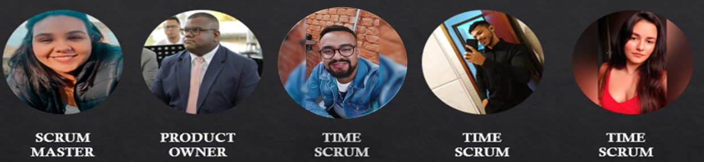

# Aprendizado por Projeto Integrado (API) 

Projeto baseado na metodologia ágil SCRUM, procurando desenvolver a Proatividade, Autonomia, Colaboração e Entrega de Resultados dos estudantes envolvidos

# Índice

* [Projeto (API)](#projeto-api)
* [Tecnologias](#tecnologias)
* [Equipe](#equipe)
* [Objetivo do Projeto](#objetivo-do-projeto)
* [Funcionalidades e registros (vídeos e apresentações) das sprints](#funcionalidades-e-registros-(vídeos-e-apresentações)-das-sprints)
* [Cronograma das Sprints](#Cronograma-das-Sprints)
* [Backlog do produto](#Backlog-do-produto)
* [Competências desenvolvidas](#competências-desenvolvidas)
* [Autores](#autores)

# Projeto (API) 
Projeto pedagógico alicerçado na Metodologia API para ensino-aprendizado focado no desenvolvimento de competências e fundamentada nos pilares de aprendizado com problemas reais (RPBL), validação externa e mentalidade ágil. 
Uso de estratégias para entender o problema, conceber uma solução viável ao desenvolver e implementar o MVP seguido de sua operação (CDIO). 

Sprint | Previsão | Status| 
|------|--------|------|
|Kick Off | 06/09/2023 | concluido|
|01 |27/09/2023 | concluido| 
|02| 18/10/2023 | a fazer |
|03| 08/11/2023 | a fazer|
|04| 29/11/2023 |a fazer |
|Feira de Soluções|12/12/2023 |a fazer |

# Equipe

# Objetivo do Projeto
Este projeto tem como objetivo análise de veículos, de otimização de distribuição e de custo de rotas de uma empresa embarcadora de carga, visando:
* Criação e modelagem de um banco de dados em SQL;
* Criação de um visualizador de indicadores em BI;
* Aplicação do método de transportes para otimização da distribuição;

# Funcionalidades e registros (vídeos e apresentações) das sprints

## Apresentação da estrutura do Jira Software da equipe

## Tecnologias Utilizadas

  ### Produto 
  > Descreva aqui a parte do MVP referente a Sprint

# Cronograma das Sprints

Ao clicar você será redirecionado ao cronograma detalhado desse projeto, lá é possivel encontar as datas das atividades, o responsável por cada atividade, o estágio em que cada atividade se encontra e a qual sprint cada atividade pertence.

#### Cronograma das Sprints[(clique aqui)](https://thainap.atlassian.net/jira/software/projects/SCRUM/boards/1/backlog)

# Backlog do produto

## Sprint 1. 
- [x] Kick-off apresentado pelo cliente;
- [x] Criação e Estruturação do GitHub;
- [x] Criação e Estruturação do Jira;
- [x] Desenvolvimento e alimentação Backlog;
- [x] Escolha da metodologia.

## Sprint 2. 
- [ ] Análise de dados via Excel;
- [ ] Criação de tabelas, via Power BI;
- [ ] Desenvolver relatórios e dashboard no Power BI;
- [ ] Criação de chaves no Bing Maps;
- [ ] Análise via Bing Maps;
- [ ] Cáculo da produtividade por veículo via Excel;
- [ ] Cálculo da distância entre fábrica e clientes, via rotas;
- [ ] Cálculo da produtividade mensal (input e output).
      
## Sprint 3. 
- [ ] Integração MySQL e Access;
- [ ] Criação e modelagem no SQL - Prototipagem;
- [ ] Automatização da análise da base de dados via Access;
      
## Sprint 4. 
- [ ] Entrega de resultados para cliente;
- [ ]  Criação e edição do vídeo para Feira de Soluções.

  
# Competências desenvolvidas

## Hard Skill 
  
| Tecnologia/Metodologia | Classificação |
| ---------------------- | ------------- |
| GitHub | ★ ★ ★ ★ ★ ★ ★ ☆ ☆ ☆ |
| Gestão de Projetos | ★ ★ ★ ★ ★ ★ ☆ ☆ ☆ ☆ |
| Scrum Master | ★ ★ ★ ★ ★ ★ ★ ☆ ☆ ☆ |
| Prodct Owner | ★ ★ ★ ★ ★ ★ ★ ☆ ☆ ☆ |
| Markdown | ★ ★ ★ ★ ★ ★ ★ ☆ ☆ ☆ |
| Git Projects | ★ ★ ★ ★ ★ ★ ★ ☆ ☆ ☆ |
 

## Soft Skill 

| Habilidades | Classificação |
| ---------------------- | ------------- |
| Colaboração | ★ ★ ★ ★ ★ ☆ ☆ ☆ ☆ ☆ |
| Proatividade| ★ ★ ★ ★ ★ ★ ☆ ☆ ☆ ☆ |
| Pensamento Crítico | ★ ★ ★ ★ ★ ★ ★ ☆ ☆ ☆ |
| Gerenciamento de Tempo | ★ ★ ★ ★ ★ ★ ★ ☆ ☆ ☆ |
| Adaptabilidade | ★ ★ ★ ★ ★ ★ ★ ☆ ☆ ☆ |
| Resiliência | ★ ★ ★ ★ ★ ★ ★ ☆ ☆ ☆ |

# Autores
|    Função     | Nome                                  |                                                                                                                                                      LinkedIn & GitHub                                                                                                                                                      |
| :-----------: | :------------------------------------ | :-------------------------------------------------------------------------------------------------------------------------------------------------------------------------------------------------------------------------------------------------------------------------------------------------------------------------: |
| Product Owner |   Lucas Gabriel Fernandes      |               |             |
| Scrum Master  | Victória Crispim |             |
| Team Member   | Filipe Silva    |           |
|  Team Member  | João Gabriel Pereira               |                  |
|  Team Member  | Thainá Simões              |       |

